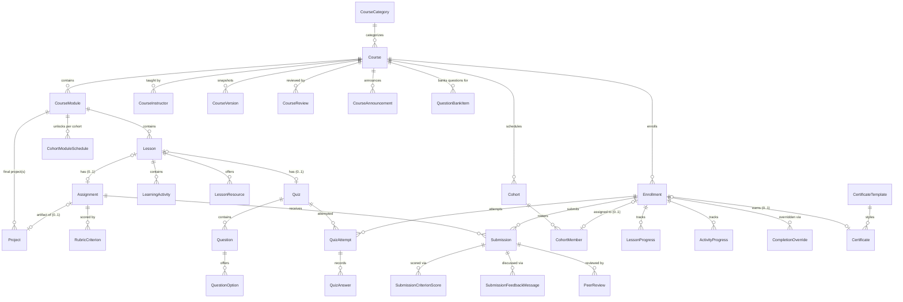

# Data Model: Learning Management System

**Spec**: [spec.md](./spec.md) | **Plan**: [plan.md](./plan.md) | **Research**: [research.md](./research.md)

**Status**: Written retrospectively, after implementation. Every entity, field, enum, and relationship below is drawn directly from `database/prisma/schema.prisma` as it exists in the repository today (Spec 004 section: `CourseCategory` through `CompletionOverride`, plus the additive fields other 004 batches attached to Part 1/Part 2 models). Nothing below is aspirational — if a field, entity, or relationship isn't in the schema, it isn't in this document. Prisma model names are used throughout; the `@map("...")` snake_case table/column names are omitted for brevity except where they aid cross-referencing with raw SQL/migrations.

## How to read this document

Each entity lists: **purpose**, **key fields** (not exhaustive — omits routine `id`/`createdAt`/`updatedAt` unless notable), **relationships**, and **notable constraints**. Full field-by-field detail (including every `@db.VarChar` length and doc comment) lives in the schema file itself, which is the actual source of truth this document summarizes.

Status/lifecycle fields use `PascalCase` enum types; exact enum values are listed once, in the "Enums" section per domain, rather than repeated on every entity that uses them.

---

## 1. Catalog & Course Structure

The authoring hierarchy: `CourseCategory` → `Course` → `CourseModule` → `Lesson` → `LearningActivity`/`LessonResource`. A `Course` also has `CourseInstructor` assignments, `CourseVersion` snapshots, and (for cohort-scheduled courses) `Cohort`/`CohortMember`/`CohortModuleSchedule`.

### CourseCategory
Optional self-referencing hierarchy (`parentId` → `CourseCategory`) for catalog browsing. Archived, never hard-deleted once a `Course` references it (`onDelete: Restrict` on the parent self-relation).
- **Key fields**: `name`, `slug` (unique), `description`, `shortDescription`, `imageUrl`, `icon`, `sortOrder` (sibling ordering), `status`, `isFeatured`, `metadata` (Json, free-form extras).
- **Relationships**: self-referencing `parent`/`children`; one-to-many `courses`.

### Course
The primary authoring entity (FR-014). Rich-text `description` is sanitized at **render time** by the frontend's DOMPurify allowlist, not a backend sanitizer.
- **Key fields**: `title`, `slug` (unique), `subtitle`, `shortDescription`, `description`, `learningOutcomes: String[]`, `tags: String[]`, `targetAudience`, `toolsRequired: String[]`, `thumbnailUrl`, `coverImageUrl`, `trailerUrl`, `language` (reuses CMS `PageLanguage`), `level`, `status`, `categoryId`, `durationMinutes`, `estimatedCompletionMinutes`, `weeklyCommitmentMinutes`, `certificateAvailable: Boolean`, `certificateTemplateId`, `priceType`, `priceAmountMinor: Int` (money-safe minor units — no float), `currency`, `isFeatured`, `enrollmentLimit`, `sequencingMode`, `enrollmentStartAt`/`enrollmentEndAt`, `publishAt`/`expireAt`, `seoTitle`/`seoDescription`/`canonicalUrl`, `reviewNotes` (cleared on every resubmission), `ratingAverage`/`ratingCount` (from `CourseReview`), `learnerCount` (from `Enrollment`), `version` (optimistic-concurrency counter, not yet enforced at the service layer), `createdBy`/`updatedBy`/`reviewedBy`/`publishedBy`, `translationOfCourseId` (self-relation) / `translationStatus`.
- **Relationships**: `modules`, `instructors`, `enrollments`, `versions`, `certificates`, `reviews`, `courseAnnouncements`, `waitlistEntries`, `wishlistEntries`, `learnerNotes`, `bookmarks`, `cohorts`, `questionBankItems`; self-relation `translationVariants`.
- **Constraints**: indexed on `status`, `categoryId`, `(status, publishAt)`, `isFeatured`.

### CourseVersion
Append-only snapshot taken automatically whenever an already-`PUBLISHED` course is edited (`snapshotCourseIfPublished`) — Historical Immutability (Constitution Article IV).
- **Key fields**: `versionNumber` (per-course sequence), `snapshot: Json` (the full `Course` row at that moment), `changeSummary` (admin free text, nullable), `effectiveDate` (nullable = "immediately"), `existingLearnerPolicy`.
- **Constraints**: `@@unique([courseId, versionNumber])`.

### CourseModule
Ordered top-level content grouping (chapter). Configuration-only fields (`releaseRuleType`, `completionRuleType`) are enforced by the service layer, not the schema itself.
- **Key fields**: `title`, `description`, `outcome`, `position` (unique per course), `estimatedDurationMinutes`, `isMandatory`, `prerequisiteModuleId` (self-relation, same-course only, cycle-checked), `releaseRuleType`, `releaseRuleValue: Json` (type-dependent shape, e.g. `{"days": 7}`), `manuallyReleasedAt`, `completionRuleType`, `status`, `isPreview`, `metadata: Json`.
- **Relationships**: `lessons`, `courseAnnouncements`, `cohortSchedules`, `projects`.
- **Constraints**: `@@unique([courseId, position])`.

### CourseInstructor
Join between `Course` and `User` with a role.
- **Key fields**: `role` (`INSTRUCTOR` | `TEACHING_ASSISTANT`), `isPrimary`.
- **Constraints**: `@@unique([courseId, userId])`; exactly one primary instructor per course enforced by a hand-added partial unique index (not expressible in Prisma's DSL).

### Cohort / CohortMember / CohortModuleSchedule
A named group of learners on the same schedule, attached to a `Course` (no `Program` entity exists). `CohortMember.enrollmentId` is the *same* `Enrollment` row that governs access — a cohort roster is never a parallel membership list.
- **Cohort**: `name`, `startDate`, `endDate` (nullable = open-ended), `timezone` (IANA, advisory display only), `capacity` (nullable = uncapped), `status`.
- **CohortMember**: `userId`, `enrollmentId` (unique — one cohort per enrollment), `joinedAt`. `@@unique([cohortId, userId])`.
- **CohortModuleSchedule**: `moduleId`, `unlockAt` — the actual data source for a module whose `releaseRuleType = COHORT_SCHEDULE`. `@@unique([cohortId, moduleId])`.

### Lesson
The individual learning unit inside a module. Carries **no** `type` field of its own — each attached `LearningActivity` carries its own type, avoiding two competing sources of content-type truth.
- **Key fields**: `title`, `slug` (unique per module), `summary`, `description`, `position` (unique per module), `durationMinutes`, `isPreview`, `isMandatory`, `completionRuleType`, `completionRuleValue: Json`, `completionRuleTypes: LessonCompletionRuleType[]` (when non-empty, the authoritative AND-combined multi-condition set; `completionRuleType` remains the single-condition fallback), `status`, `version`, `deletedAt` (soft delete only).
- **Relationships**: `activities`, `progress` (`LessonProgress`), `quiz` (0-or-1), `assignment` (0-or-1), `learnerNotes`, `bookmarks`, `resources`.

### LearningActivity
Metadata-only content unit attached to a lesson — no runtime playback/streaming engine, just typed references.
- **Key fields**: `type`, `title`, `position` (unique per lesson), `mediaUrl` (safe-scheme-only URL: `https://` or an internal path — VIDEO/AUDIO/DOWNLOAD/PDF), `externalUrl` (EXTERNAL_LINK), `bodyText` (ARTICLE, sanitized text), `durationSeconds` (VIDEO/AUDIO), `fileSizeBytes` (DOWNLOAD/PDF, metadata only), `embedProvider`/`embedResourceId` (EMBED, closed allowlist: `youtube`/`vimeo`/`google_drive`/`loom` — never a raw iframe string), `captionsUrlEn`/`captionsUrlTa` (VIDEO/AUDIO, WebVTT URLs, rendered via native `<track>`), `transcriptSegments: Json` (ordered `{startSeconds, text}[]` — backs search, timestamp navigation, and download), `status`.
- **Relationships**: `progress` (`ActivityProgress`), `bookmarks`.
- **Constraints**: `@@unique([lessonId, position])`.

### LessonResource
A richer, standalone downloadable-asset catalog distinct from a `DOWNLOAD`-type `LearningActivity` — its own "Resources" area in the lesson player (FR-049).
- **Key fields**: `title`, `type`, `description`, `language`, `fileUrl`, `fileSizeBytes`, `version`, `downloadPermission`, `accessRule`, `position`, `status`.

---

## 2. Enrollment, Access & Learner-Owned Lists

### Enrollment
The record of a learner's access grant to a course (FR-021–033). Typed enums/timestamps throughout — never a JSON blob.
- **Key fields**: `userId`, `courseId`, `source`, `status`, `entitlementReference` (opaque string — LMS does not own the referenced record's schema), `enrolledAt`, `activatedAt`, `accessStartAt`/`accessEndAt` (access window; both nullable), `suspendedAt`, `cancelledAt`, `revokedAt`, `completedAt` (server-derived only), `expiredAt`, `lastAccessedAt`, `migratedToVersionNumber` (course-versioning-policy migration tracking).
- **Relationships**: `lessonProgress`, `completionOverrides`, `activityProgress`, `quizAttempts`, `submissions`, `certificate` (0-or-1), `peerReviewsGiven`, `cohortMembership` (0-or-1).
- **Constraints**: one `ACTIVE`/`PENDING` enrollment per `(userId, courseId)` via a hand-added partial unique index — a `CANCELLED`/`REVOKED`/`EXPIRED` enrollment does not block re-enrollment.

### WaitlistEntry
Only meaningful for a course with `Course.enrollmentLimit` set (FR-028/029).
- **Key fields**: `priority` (monotonic per-course join-order counter, never reassigned/reused), `referralSource`, `status`, `joinedAt`, `offeredAt`, `offerExpiresAt` (time-limited reservation, swept at read time — no background job scheduler exists), `offerEmailSentAt`, `claimedAt`.
- **Constraints**: one `WAITING`/`OFFERED` entry per `(userId, courseId)` via partial unique index.

### WishlistEntry
A simple save-for-later list (FR-027), distinct from the capacity-gated `WaitlistEntry`. Add/remove is idempotent.
- **Key fields**: `priceAtSaveAmountMinor`/`priceAtSaveCurrency` (snapshotted for price-drop detection), `enrollmentOpenNotifiedAt`, `priceDropNotifiedAt`.
- **Constraints**: `@@unique([userId, courseId])`.

### LearnerNote / Bookmark
Strictly private to their owner — **no admin-facing read path exists for either model anywhere in the API surface** (FR-033 explicitly bars even an organization admin from reading a learner's notes; enforced by omission, not just a permission check).
- **LearnerNote**: `content` (sanitized rich/plain text), `videoTimestampSeconds` (nullable).
- **Bookmark**: `type`, `videoTimestampSeconds` (VIDEO_TIMESTAMP only), `textSectionAnchor` (TEXT_SECTION only), `activityId` (RESOURCE only), `note`, `folder`. `DISCUSSION` is a defined-but-API-rejected enum value (no Discussion entity exists — Spec 005 territory).

---

## 3. Progress & Completion

### LessonProgress
Per-learner, per-lesson completion state — the only progress table that is actually **stored**; module/course/path progress are **derived at read time** by `progress.service.ts` (`computeModuleProgress`/`computeCourseProgress`), avoiding a second, driftable source of truth.
- **Key fields**: `status`, `percentage` (0–100, server-derived, anti-rollback clamped — never accepted verbatim from a client), `timeSpentSeconds` (bounded per-tick increments), `lastPosition: Json` (discriminated by activity kind: video/audio position, article scroll percent, PDF page — see `progress.validation.ts`'s `lastPositionSchema`), `startedAt`, `lastAccessedAt`, `completedAt` (server-derived only), `completionSource`, `version` (optimistic-concurrency guard, incremented every update).
- **Constraints**: `@@unique([enrollmentId, lessonId])`.

### ActivityProgress
Real, server-derived "has this enrollment viewed this activity" tracking, backing `ALL_ACTIVITIES_VIEWED` completion — plus (additively) per-activity video playback telemetry (FR-040).
- **Key fields**: `viewedAt` (idempotent, set once); `watchedSeconds` (cumulative, bounded per-tick), `furthestPositionSeconds` (monotonic anti-rollback — position-only, not interval-based, so a forward seek also advances it), `lastPositionSeconds` (resume point — CAN move backward on rewind), `playbackStartCount`, `completedPlaybackAt` (first time `furthestPositionSeconds` crossed the watch threshold), `rewatchCount` (a start reported after `completedPlaybackAt` is set), `lastPlaybackSpeed`, `lastUserAgent` (server-captured from the `User-Agent` header — same raw-capture convention as `Session.userAgent`, never a client-trusted device field).
- **Constraints**: `@@unique([enrollmentId, activityId])`.

### CompletionOverride
Generic, reusable override record for FR-113's "admin/instructor override with a stated reason, audit entry." One table for all three scopes rather than a bespoke table each.
- **Key fields**: `scope` (`LESSON`/`MODULE`/`COURSE`), `targetId` (the target row's id — loosely referenced, not a typed FK, since the target table varies by scope), `action` (`MARK_COMPLETE`/`RESET`), `reason`, `actorId`, `previousValue`/`newValue: Json`.

### LearningStreak
One row per user — a cross-course engagement signal, never a spendable/redeemable balance (Constitution Article V does not apply). Server-authoritative only; a client can never assert a streak value.
- **Key fields**: `currentStreakDays`, `longestStreakDays`, `lastQualifyingDate` (a calendar date in `LmsSettings.streakTimezone`, immutable once recorded even if the timezone setting later changes), `todaysLearningSeconds`/`todaysLearningDate` (daily accumulator backing the minimum-learning-time qualifying action).
- Only fed by genuine learner actions (`MANUAL_LEARNER`/`SIGNAL_DERIVED` lesson completion, a passed `QuizAttempt`, a genuine `Submission`, or the server-bounded time accumulator) — **never** by an instructor/admin override.

---

## 4. Assessments (Quiz + Question Bank)

Simpler than spec.md's fullest FR-064 vision by design: `Question` rows belong directly to **one** `Quiz` (per-quiz list), with a separate, genuinely reusable `QuestionBankItem` catalog scoped to a *course* that **generates** (copies) questions into a quiz rather than referencing them live.

### Quiz
1:1 with a `Lesson` (mirrors FR-017's "Quiz" lesson type — not a `LearningActivity`, since a quiz's attempt/scoring structure doesn't fit that metadata-only shape).
- **Key fields**: `title`, `instructions`, `quizType`, `passingScorePercent`, `maxAttempts` (nullable = unlimited), `timeLimitMinutes` (nullable = untimed), `randomizeQuestions`/`randomizeAnswers`, `showCorrectAnswers` (FR-067 answer-review visibility), `status`, `version`.

### Question / QuestionOption
- **Question**: `type`, `prompt`, `explanation` (shown post-submission only if `showCorrectAnswers`), `points`, `position` (unique per quiz), `answerKey: Json` (SHORT_ANSWER/FILL_BLANK: `{acceptedAnswers: string[]}`; NUMERIC: `{correctValue, tolerance}`; choice types use `QuestionOption.isCorrect` instead), `status`, `deletedAt` (soft delete — a historical `QuizAnswer` must remain interpretable even after the question is "deleted").
- **QuestionOption**: `text`, `isCorrect`, `position` (unique per question).

### QuestionBankItem / QuestionBankItemOption
A reusable question **template**, scoped to a `Course` (T107, FR-064). Generating a quiz's question set **copies** a bank item's content into a brand-new `Question`/`QuestionOption` pair — never a live reference — so editing/deleting a bank item after generation never retroactively changes an already-built quiz.
- **QuestionBankItem**: `type`, `prompt`, `explanation`, `points`, `category` (free-text tag), `difficulty`, `learningObjective`, `tags: String[]`, `language`, `version`, `reviewStatus` (only `APPROVED` items are drawn for generation), `usageCount` (incremented per successful draw), `answerKey: Json`, `status`, `deletedAt`.
- No equivalent "Assignment Bank" exists — FR-098's "assessment bank" clone mode covers quizzes/question-bank content only.

### QuizAttempt / QuizAnswer
- **QuizAttempt**: `attemptNumber` (1-based per enrollment+quiz, server-assigned), `status`, `startedAt`, `expiresAt` (computed from `timeLimitMinutes` at start), `submittedAt`, `gradedAt`, `pointsPossible`/`pointsEarned`/`scorePercent`, `passed`. `@@unique([enrollmentId, quizId, attemptNumber])`.
- **QuizAnswer**: `selectedOptionIds: String[]` (choice types), `answerText` (SHORT_ANSWER/FILL_BLANK/NUMERIC, stored as text, parsed at grading), `isCorrect`/`pointsAwarded` (null until graded), `answeredAt`. `@@unique([attemptId, questionId])`.

---

## 5. Assignments & Project-based Learning

`Assignment` is the single, reused building block behind FOUR distinct assessment types (`AssessmentType`) and — via the new `Project` grouping layer — multi-artifact project-based learning. No parallel schema exists for any of these; they are all `Assignment` rows with additive fields/associations.

### Assignment
1:1 with a `Lesson`.
- **Key fields**: `title`, `instructions`, `learningOutcome`, `submissionFormat`, `allowedFileTypes: String[]` (advisory only — link-based submissions, no upload/MIME enforcement), `dueAt`, `maxScore`, `passingScore`, `latePolicy`, `maxAttempts` (nullable = unlimited resubmissions after `CHANGES_REQUESTED`), `status`, `assessmentType` (STANDARD/SELF_ASSESSMENT/SKILL_RATING/SCENARIO_TASK/PORTFOLIO_REVIEW — see §"Assessment types" below), `projectId`/`projectPosition` (nullable — set when this assignment is one required artifact of a `Project`), `peerReviewEnabled`/`peerReviewsRequired`/`peerReviewAnonymous`/`peerReviewDeadlineDays`/`peerReviewIncludeInGrade` (FR-076), `version`.
- **Constraints**: `@@unique([projectId, projectPosition])` (Postgres unique indexes permit unlimited NULLs, so standalone assignments never collide).

#### Assessment types (`AssessmentType`)
| Value | Grading path | Notes |
|---|---|---|
| `STANDARD` | Instructor review (`reviewSubmission`) | Default; the original FR-069–075 flow. |
| `SELF_ASSESSMENT` | Learner self-scores (`submitSelfAssessment`) | Immediate outcome; `reviewSubmission` rejects it. |
| `SKILL_RATING` | Learner self-scores (`submitSelfAssessment`) | Same mechanics as SELF_ASSESSMENT; the rubric IS the rating scale. |
| `SCENARIO_TASK` | Instructor review (`reviewSubmission`) | Semantic label only — mechanically identical to STANDARD. |
| `PORTFOLIO_REVIEW` | Instructor review (`reviewSubmission`) | Semantic label only — mechanically identical to STANDARD. |

For the two self-scored types, the normal `submitSubmission` endpoint is rejected (service-layer guard); for the three instructor-reviewed types, `submitSelfAssessment` is rejected. The two paths are mutually exclusive per assignment.

### RubricCriterion
- **Key fields**: `title`, `description`, `maxPoints`, `position` (unique per assignment), `deletedAt` (soft delete — a scored historical criterion must remain interpretable).

### Project
**FR-077.** The thin grouping layer over multiple required-artifact `Assignment`s — deliberately not a new artifact/submission schema. Scoped to a `CourseModule` (not a whole course), since FR-077 requires project status to connect to *module* completion.
- **Key fields**: `title`, `description`, `status` (reuses `CourseModuleStatus`: DRAFT/PUBLISHED/ARCHIVED — only a PUBLISHED project's artifacts count toward completion/eligibility gates), `version`.
- **Relationships**: `artifacts` (the `Assignment[]` linked via `Assignment.projectId`).
- A project cannot be published with zero linked artifacts (service-layer guard).

### Submission
- **Key fields**: `attemptNumber` (1-based; a resubmission after `CHANGES_REQUESTED` creates a **new row**, never overwrites — full history stays visible), `status`, `textBody`, `linkUrl`, `submittedAt`, `isLate` (computed at submit time from `dueAt`), `declaredOriginal` (FR-116 originality affirmation, captured at the SUBMITTED transition, defaults `true` for pre-existing rows), `score`, `passed`, `outcomeLevel` (server-derived 3-band scale — Beginner/Intermediate/Advanced — from score-as-percent-of-rubric-total, computed identically whether self-assessed or instructor-reviewed), `isSelfAssessed` (true when scored via `submitSelfAssessment`; `reviewerId` stays null in that case), `reviewerId`/`reviewedAt`/`reviewerNote` (private, instructor-only)/`learnerFeedback` (learner-facing — also serves as the "recommendation" outcome dimension for SCENARIO_TASK/PORTFOLIO_REVIEW), `feedbackViewedAt` (idempotent, set once).
- **Constraints**: `@@unique([enrollmentId, assignmentId, attemptNumber])`.

### SubmissionCriterionScore
Per-criterion instructor (or self-assessment) score. `@@unique([submissionId, criterionId])`.

### SubmissionFeedbackMessage
FR-078's "mark viewed / reply / request clarification" conversation thread — flat and chronological (not nested), scoped to one submission's feedback. `authorRole` + `type` (`REPLY`/`CLARIFICATION_REQUEST`, learner-only distinction; an instructor message is always `REPLY`).

### PeerReview / PeerReviewCriterionScore
FR-076. A reviewer self-selects an open submission from a queue (no automatic reviewer-matching algorithm), scores it against the *same* `RubricCriterion` set the instructor uses — informing, never automatically overriding, the instructor's own grade.
- **PeerReview**: `reviewerEnrollmentId` (the reviewer's own enrollment — self-review rejected at the service layer), `status`, `comment`, `totalScore`, `claimedAt` (caps concurrent claims at `peerReviewsRequired`), `submittedAt`, `moderationStatus`/`moderatedBy`/`moderatedAt`/`moderationReason` (HIDE/RESTORE, never delete — same pattern as `CourseReview`). `@@unique([submissionId, reviewerEnrollmentId])`.

---

## 6. Certification

### CertificateTemplate
Image/color/font references only — plain admin-supplied URLs, no upload pipeline.
- **Key fields**: `name`, `backgroundUrl`/`logoUrl`/`signatureUrl`/`sealUrl`, `fontFamily`, `primaryColor`, `language`, `isActive`, `deletedAt`.

### Certificate
Only `COURSE_COMPLETION` is actually issuable (the other six `CertificateType` values exist for taxonomy truthfulness but have no owning generation path — no LearningPath/Program/Event/Challenge/Organization-training entity exists).
- **Key fields**: `credentialId` (unique, short, public — never the raw internal `id`), `certificateType`, `learnerName`/`courseTitle`/`instructorName`/`organizationName` (**snapshotted at issuance**, Historical Immutability — never a live join), `completionDate`, `issuedAt`, `expiresAt`, `status`, `revokedAt`/`revokedBy`/`revokedReason`, `templateId`, `eligibilitySnapshot: Json` (every FR-081 condition checked and its result, at issuance time).
- **Constraints**: `@@unique` on `enrollmentId` (at most one certificate per enrollment) and on `credentialId`.
- `"NOT_FOUND"` (FR-085) is not a stored status — it's what the public verification endpoint returns when no row matches the requested credential ID.

---

## 7. Community-adjacent Learner Features

### CourseReview
One VISIBLE-or-HIDDEN review per learner per course (`@@unique([courseId, userId])` — a learner *updates* their existing review rather than creating a second one).
- **Key fields**: `rating` (1–5, validation-layer enforced), `title`, `comment`, `outcome`, `wouldRecommend`, `isAnonymous` (only the public serializer omits the name; never anonymous to moderation), `status`, `hiddenBy`/`hiddenAt`/`hiddenReason`.

### CourseAnnouncement
Named distinctly from Spec 002's own site-wide `Announcement` (a different entity). Course-wide by default; `moduleId` optionally narrows scope without requiring the module to be unlocked for the reader.
- **Key fields**: `title`, `message`, `priority`, `channels: CourseAnnouncementChannel[]`, `attachmentUrl` (advisory link, no upload), `status`, `publishAt`/`expireAt` (evaluated at read time, no scheduler), `emailSentAt` (best-effort send via the shared `EmailPort`, set once so re-publishing never double-sends).

---

## 8. Cross-cutting: Analytics, Settings, Governance

### LearningEvent
Append-only analytics log (FR-109's taxonomy). `userId`/`courseId`/`lessonId`/`enrollmentId` are **plain ids, not foreign keys** — this high-volume log can never be blocked by, or block, a user/course/lesson delete (same design as the platform-wide `AuditEvent`).
- **Key fields**: `eventType`, `metadata: Json`, `occurredAt`.
- 19 types are named in FR-109; 17 are modeled and real (`LEARNING_PATH_STARTED`/`COMPLETED` are deliberately not modeled — no `LearningPath` entity exists). `RESOURCE_VIEWED`/`RESOURCE_DOWNLOAD_STARTED` are additive, required by FR-049 specifically.

### LmsSettings
A single-row (`id = "global"`) application-level singleton — every field replaces a value that was previously a hardcoded constant scattered across a service file. A course/lesson/quiz/assignment/resource's own explicit value always wins; these are fallbacks only.
- **Key fields**: `defaultVideoWatchThresholdPercent` (was `80`), `defaultQuizPassingScorePercent` (was `70`), `defaultQuizMaxAttempts`/`defaultAssignmentMaxAttempts` (were `null`), `defaultResourceDownloadPermission` (was `DOWNLOADABLE`), `defaultLessonCompletionRuleType` (was `MANUAL`), `courseReviewMinProgressPercent` (was `50`), `streakQualifyLessonComplete`/`streakQualifyQuizComplete`/`streakQualifyAssignmentActivity`/`streakQualifyMinLearningTime`/`streakMinLearningTimeMinutes`, `streakTimezone` (IANA, installation-wide — no per-user timezone preference exists), `streakGraceDays`.
- FR-114 also names "offline policy," "reminder frequency," "discussion default," and "course archival policy" — **not modeled**: no owning subsystem (offline queue, reminder scheduler, Community, archival scheduler) exists to consume them.

### Academic integrity (reused entity — no new model)
Academic-integrity investigation (FR-116) **reuses Spec 001's `TrustSafetyCase`/`Appeal` state machine** rather than a parallel LMS-only entity — `TrustSafetyCaseType` gained six additive LMS values (`PLAGIARISM`, `UNAUTHORIZED_COLLABORATION`, `IDENTITY_FRAUD`, `QUIZ_CHEATING`, `FABRICATED_SUBMISSION`, `CERTIFICATE_FRAUD`) and `TrustSafetyTargetType` gained three (`SUBMISSION`, `QUIZ_ATTEMPT`, `CERTIFICATE`). `academic-integrity.service.ts` is a thin, LMS-scoped wrapper over the existing case/appeal service.

---

## Entities Deliberately Not Modeled

Named in spec.md's Key Entities but never given a table, because no code path in this codebase could ever populate or consume them honestly:

| Entity | Why absent |
|---|---|
| `LearningPath`, `Program`, `LearningPathCourse` | Large, separate future effort; `Course`/`CourseModule`/`Cohort` cover everything actually built (see `docs/lms/DECISION_GATES.md` gate #27). |
| `LiveSession`, `Attendance` | No live-class (Google Meet/Zoom) provider integration exists. |
| A dedicated `AcademicIntegrityCase`/`PlagiarismReport` | Reuses `TrustSafetyCase` (see §8) instead of a parallel entity. |
| An "Assignment Bank" (reusable-template catalog for assignments) | No such FR names it — `QuestionBankItem` only covers quizzes. |
| A `Discussion`/comment-thread entity | Spec 005 (Community) territory; `Bookmark.type = DISCUSSION` and `LmsSettings`'s "discussion default" are reserved-but-unused placeholders for it. |
| Any `Order`/`Payment`/`Invoice`/`Refund` entity | Spec 009 (Payments) territory — `Enrollment.entitlementReference` is a loose opaque string a future integration can populate. |

---

## Entity Relationship Overview

